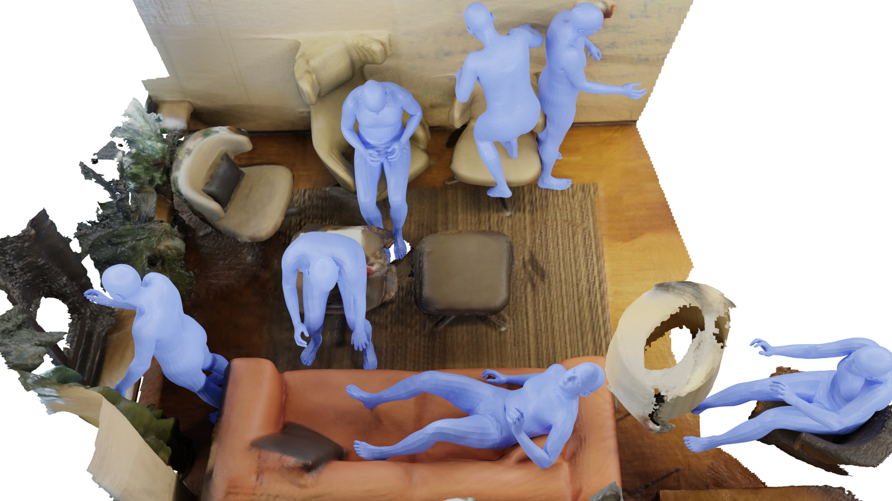

# Diverse 3D Human Pose Generation in Scenes based on Decoupled Structure (CASA 2024)



Code repository for the paper "Diverse 3D Human Pose Generation in Scenes based on Decoupled Structure".


## Contents

1. [Code Structure](#code-structure)
2. [Install](#install)
3. [Data](#data)
4. [Run](#run)
5. [Reference](#reference)


## Code Structure

`cfg_files`: Parameters for training and generation.

`lib/misc/utils`: Miscellaneous parameters, functions, and classes.

`models`: Pose generator and contact generator.

`train_posa.py`: Functions for training the contact generator.

`affordance.py`: Functions for generation.

`run.py`: Scripts for running the training and generation.


## Install

This code respository is mainly based on POSA, please refer to [this](https://github.com/mohamedhassanmus/POSA) repository for the installation of the environment.


## Data

Before running the code, you need to download the following data:

- [AMASS](https://amass.is.tue.mpg.de/) dataset.
- [POSA](https://posa.is.tue.mpg.de/) dataset.
- [SMPL-X](https://smpl-x.is.tue.mpg.de/) human body model.
- [Matterport3D](https://niessner.github.io/Matterport/) scene dataset.
- [MP3D-R](https://github.com/yz-cnsdqz/PSI-release) SDF extentions for Matterport3D scenes.


## Run

You need to train the pose and contact generator before running the generation.

#### Training

Uncomment the corresponding line and run `run.py` to train the contact generator: 

```
run_train_posa()
```

#### Generation

After training the pose generator and contact generator, you can use the trained model during the generation. Uncomment the corresponding line and run `run.py` to run the generation: 

```
run_affordance('ours_debug', debug=True)
```

By default, this will generate only one sample in offscreen mode. You can modify the parameters for visualizing the generation process and generaing more samples in one time.


## Reference

We referred to some code of [POSA](https://github.com/mohamedhassanmus/POSA). The pose generator is based on [VPoser](https://github.com/nghorbani/human_body_prior). Thanks to these authors for their great work.
